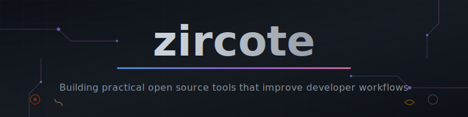
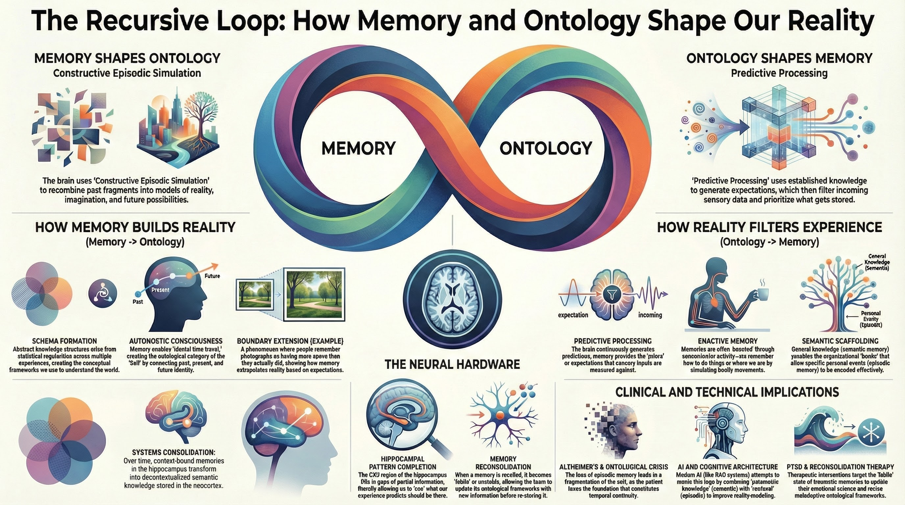

<p align="center">
  
</p>

<p align="center">
  <a href="https://github.com/zircote"></a>
  <a href="https://github.com/zircote?tab=repositories"></a>
  <a href="https://github.com/zircote/swagger-php"></a>
</p>

<p align="center">
  <a href="https://www.linkedin.com/in/zircote/"></a>
  <a href="https://zircote.github.io/"></a>

</p>

---

## About

**Robert Allen** is a Systems/Platform engineer, technologist, open source maintainer and sheep and poultry farmer based in Farmville, Virginia. By day, he drives infrastructure automation at [HMH](https://www.hmhco.com/). By evening, he builds developer tools that solve real problems in technology and agriculture. And somehow also runs a [regenerative pasture farm](https://epicpastures.com/).

Creator of **[swagger-php](https://github.com/zircote/swagger-php)**, the PHP library for generating OpenAPI documentation from annotations. Much appreciation to the community of contributors and users who have made it a success over the years.

### Focus Areas

- **Open Source Tooling** - Creating and maintaining tools that developers actually use
- **AI-Assisted Development** - Building Claude Code plugins, agents, and workflows
- **DevOps & Platform Engineering** - Infrastructure automation, CI/CD, AWS architecture
- **Architecture Documentation** - ADRs, decision tracking, knowledge capture

---

## Current Exploration: Memory, Ontology & AI

The intersection of cognitive science and AI systems presents a compelling question: **how do we build AI that remembers meaningfully?**

Human memory isn't a tape recorder—it's a constructive process where our mental models (ontology) shape what we encode, and our memories reshape how we understand the world. This recursive loop is central to how we learn, adapt, and make sense of novel situations.



This exploration drives projects like **[subcog](https://github.com/zircote/subcog)**—a persistent memory system for AI coding assistants. Rather than treating context as disposable, subcog implements structured memory that persists across sessions, enabling AI to build genuine understanding over time:

- **Episodic memory** captures session events and debugging journeys
- **Semantic memory** stores decisions, knowledge, and learned concepts
- **Procedural memory** encodes patterns and reusable workflows
- **Ontology-driven discovery** identifies entities worth remembering

The goal: AI assistants that don't just respond—they accumulate knowledge, recognize patterns, and evolve their understanding of your codebase and preferences.

---

## Active Projects

<!-- LAST_UPDATED_START -->
 __Last updated: 2026-01-25__
<!-- LAST_UPDATED_END -->

### Most Active Repositories

Ranked by recent contributions, community engagement, and development activity.

<!-- ACTIVE_REPOS_START -->
| Repository | Description | Tech | Activity |
|------------|-------------|------|----------|
| [swagger-php](https://github.com/zircote/swagger-php) | A php swagger annotation and parsing library | PHP | ✨ Active |
| [subcog](https://github.com/zircote/subcog) | Persistent memory system for AI coding assistants. Captures ... | Rust | ✨ Active |
| [sdlc-quality](https://github.com/zircote/sdlc-quality) | Software Development Lifecycle standards plugin for AI codin... | Shell | 📈 Growing |
| [mnemonic](https://github.com/zircote/mnemonic) | Persistent filesystem-based memory system for Claude Code. P... | Python | 📈 Growing |
| [homebrew-tap](https://github.com/zircote/homebrew-tap) | Homebrew formula for git-adr - Architecture Decision Records... | Ruby | 📈 Growing |
| [rlm-rs](https://github.com/zircote/rlm-rs) | Rust CLI implementing the Recursive Language Model (RLM) pat... | Rust | 📈 Growing |
| [sigint](https://github.com/zircote/sigint) | Market intelligence toolkit for Claude Code. Iterative resea... | Unknown | 📈 Growing |
| [rlm-rs-plugin](https://github.com/zircote/rlm-rs-plugin) | Claude Code plugin for processing documents 100x larger than... | Unknown | 📈 Growing |
<!-- ACTIVE_REPOS_END -->

### Recently Created

<!-- NEW_REPOS_START -->
- **[mnemonic](https://github.com/zircote/mnemonic)** (Python) - Persistent filesystem-based memory system for Claude Code. Pure MIF Level 3 comp...
- **[MIF](https://github.com/zircote/MIF)** (Unknown) - Open standard for portable AI memory interchange. JSON-LD + Markdown dual format...
- **[sigint](https://github.com/zircote/sigint)** (Unknown) - Market intelligence toolkit for Claude Code. Iterative research workflows, trend...
- **[auto-harness](https://github.com/zircote/auto-harness)** (Shell) - Hook-driven test framework for Claude Code plugins - automates integration testi...
- **[oolong-pairs](https://github.com/zircote/oolong-pairs)** (Python) - Benchmark harness for A/B testing Claude Code plugins against OOLONG long-contex...
<!-- NEW_REPOS_END -->


---

## Technology Stack

```text
Languages        Rust | Python | TypeScript | Go 
Infrastructure   AWS | Docker | Kubernetes | Terraform | GitHub Actions
AI Integration   Claude Code | GitHub Copilot | MCP Protocol
Platforms        Linux | macOS | AWS (Solutions Architect certified)
```

---

## Principles

1. **Developer Experience First** - Tools should reduce friction, not add it
2. **Automation Over Documentation** - Encode knowledge in code
3. **Open by Default** - Share solutions that might help others
4. **Practical Over Perfect** - Ship working software, iterate based on usage

---

## Connect

- **GitHub Issues** - For project-specific discussions
- **Pull Requests** - The best way to propose changes
- **LinkedIn** - Professional networking and collaboration

---
